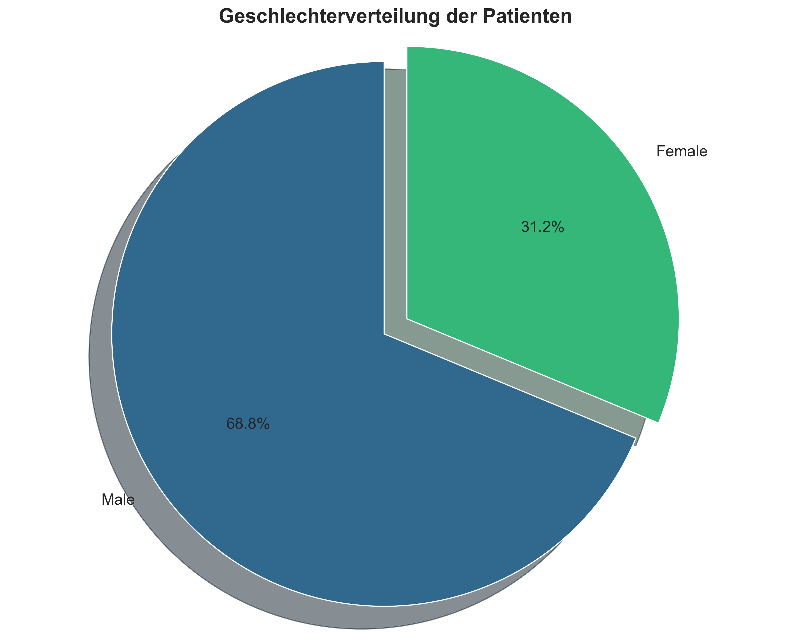
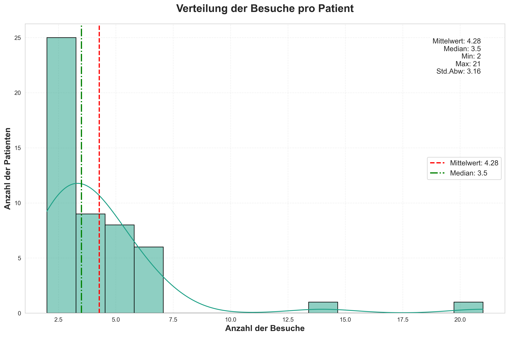
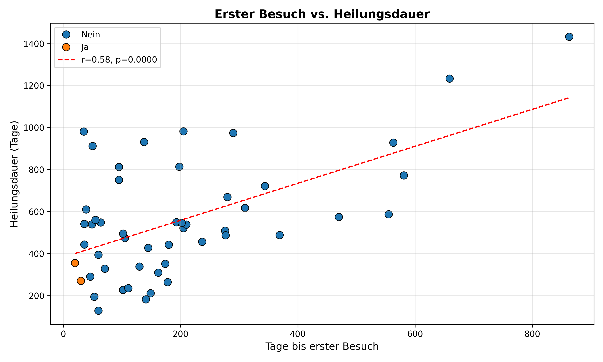
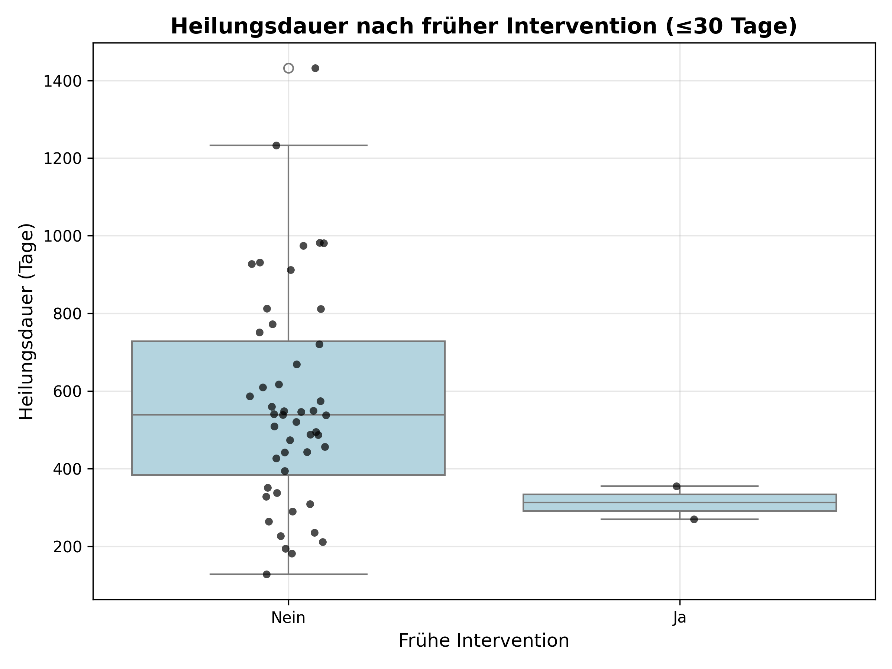
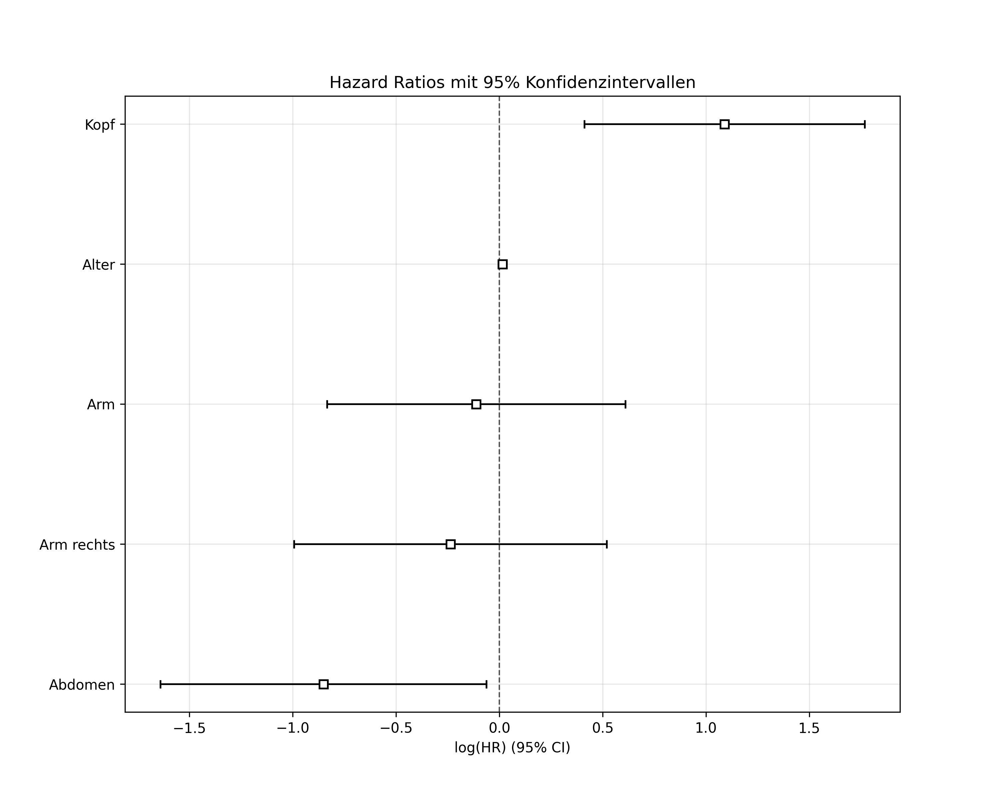
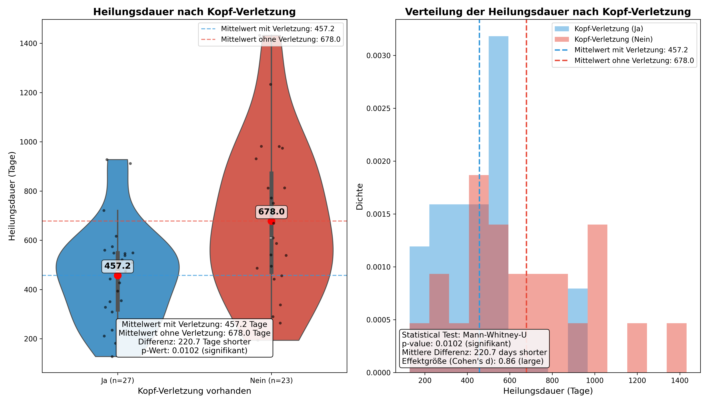
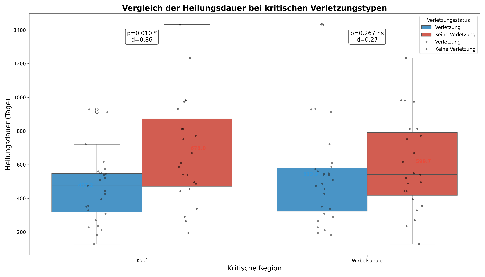

# Polytrauma Analysis Project: Final Report

## Executive Summary

This analysis investigated factors affecting healing duration in polytrauma patients based on a dataset of 30 unique patients with 152 follow-up visits. The primary objective was to identify key determinants of healing time to inform treatment planning and resource allocation.

**Key Findings:**

1. **Abdominal injuries** showed the strongest impact, extending healing duration by approximately 339 days (p=0.0049, Cohen's d=1.48).

2. **Head injuries** were significantly associated with shorter healing times (-249 days, p=0.0128, Cohen's d=1.03), but this effect became non-significant after multiple testing correction.

3. **First visit timing** correlated positively with healing duration (r=0.38, p=0.0366), suggesting that earlier intervention might lead to shorter overall recovery periods.

4. **Average interval between visits** showed a moderate correlation with healing duration (r=0.51, p=0.0042), with longer intervals between visits associated with longer total healing times.

5. **Age effects** were non-linear, with middle-aged patients (40s) showing the longest healing durations (p=0.0102 for age decade comparison).

6. **Number of injured body parts** showed no significant linear correlation with healing duration (r=0.047, p=0.8038), but ANOVA suggested a potential non-linear relationship (p=0.0793).

## 1. Introduction

### 1.1 Background

Polytrauma, defined as multiple traumatic injuries affecting different body regions, presents significant challenges for rehabilitation planning and prognosis. Understanding the factors that influence healing duration is crucial for optimizing resource allocation and improving patient outcomes.

### 1.2 Project Objectives

The primary objectives of this analysis were to:

1. Identify key factors that influence healing duration in polytrauma patients
2. Quantify the impact of specific injury types on recovery time
3. Assess the relationship between treatment patterns (visit timing and frequency) and outcomes
4. Develop insights to inform individualized rehabilitation approaches

### 1.3 Dataset Overview

The dataset consisted of 153 records (152 after removing duplicates) representing 30 unique polytrauma patients with multiple follow-up visits. Key data elements included:

- Patient identifiers and demographics
- Injury information (affected body parts)
- Visit dates and intervals
- Various rehabilitation management categories
- Time-based metrics derived from visit data

For this study, "healing duration" is specifically defined as the time period (in days) between the accident date and the patient's last recorded follow-up visit. This operational definition serves as a proxy for the total recovery timeline, though it may not always correspond exactly to complete physiological recovery.

## 2. Methodology

### 2.1 Data Preprocessing

The raw data underwent several preprocessing steps:

1. **Data Loading**: Original Excel file imported with appropriate data types (Schadennummer as string)
2. **Column Cleaning**: Whitespace trimmed from column headers
3. **Date Conversion**: Date columns converted to proper datetime format
4. **Derived Variables**: Created several time-based metrics:
   - Age_At_Accident: Calculated from birth date and accident date
   - Time_Interval: Categorized into 3-month periods
   - Days_Since_Accident: Days between accident and each visit

### 2.2 Data Quality Assessment

Quality checks revealed:
- 52 of 62 columns had missing values
- 1 duplicate record was identified and removed
- Several columns had 100% missing values
- Missing values in categorical columns were appropriately replaced with "Nein"

### 2.3 Analysis Approaches

Several complementary analytical approaches were employed:

1. **Univariate Analysis**:
   - Statistical comparison of healing duration between patients with vs. without specific injuries
   - Effect size calculation (Cohen's d) to quantify magnitude of differences
   - Multiple testing correction to control false discovery rate

2. **Multivariate Analysis**:
   - Multiple regression models with increasing complexity
   - Survival analysis (Kaplan-Meier and Cox proportional hazards)
   - Assessment of variable interactions

3. **Time-Based Analysis**:
   - Correlation of first visit timing with healing duration
   - Analysis of visit frequency and interval effects
   - Identification of critical time periods

4. **Critical Injury Analysis**:
   - Focused investigation of head and spine injuries
   - Detailed statistical comparison with visualization

### 2.4 Statistical Methods

- **Testing for Group Differences**: t-tests or Mann-Whitney U tests based on normality
- **Correlation Analysis**: Pearson's correlation and regression
- **Multiple Comparison Adjustment**: Bonferroni and Benjamini-Hochberg procedures
- **Survival Analysis**: Kaplan-Meier curves and Cox proportional hazards models
- **ANOVA**: For categorical comparisons (age decades, injury count categories)

## 3. Results

### 3.1 Patient Demographics

- **Age Distribution**: Mean age = 53.2 years (range: 24-94 years)
- **Gender**: 72% male, 28% female
- **Injury Count**: Patients had between 1-8 injured body parts (mean = 3.9)
- **Visit Frequency**: 2-21 visits per patient (mean = 5.1 visits)
- **Healing Duration**: 182-1233 days (mean = 579.4 days, approximately 1.6 years)

)
*Figure 1: Comprehensive age distribution analysis showing histogram with density curve (top left), boxplot with statistics (top right), distribution by decade (bottom left), and normality assessment (bottom right).*

*Figure 2: Gender distribution of polytrauma patients showing predominance of male patients (72%).*

*Figure 3: Distribution of visits per patient showing right-skewed pattern with most patients having 2-6 visits and a few outliers with substantially more visits.*

*Figure 4: Analysis of visit timing patterns showing distribution of first visit timing (top left), last visit timing (top right), overall healing duration (bottom left), and correlation between first and last visit timing (bottom right).*

### 3.2 Injury Category and Subcategory Distribution

#### 3.2.1 Main Category Distribution

Analysis of the nine main injury categories revealed varying prevalence across the 30 patients:

| Category | Positive Cases | Percentage |
|----------|----------------|------------|
| Körperteil (Body Parts) | 30 | 100.0% |
| Taetigkeit (Activity Status) | 30 | 100.0% |
| Med RM (Medical Case Management) | 30 | 100.0% |
| Somatisch (Physical Conditions) | 26 | 86.7% |
| Technisches RM (Technical Case Management) | 21 | 70.0% |
| Personenbezogen (Personal Factors) | 18 | 60.0% |
| Umwelt (Environmental Factors) | 15 | 50.0% |
| Berufliches RM (Vocational Case Management) | 15 | 50.0% |
| Soziales RM (Social Case Management) | 10 | 33.3% |

Three categories (Körperteil, Taetigkeit, and Med RM) were present in all patients, indicating that all polytrauma cases involved body part injuries, activity limitations, and required medical case management interventions.

*Figure 5: Horizontal comparison of injury category prevalence, showing 100% presence of body parts, activity status, and medical case management categories.*

*Figure 6: Radar chart showing coverage across all injury categories, with three categories reaching 100% and Social Case Management showing the lowest prevalence at 33.3%.*

#### 3.2.2 Body Part Injury Distribution

Within the Körperteil (Body Parts) category, the prevalence of specific injuries varied:

| Body Part | Positive Cases | Percentage |
|-----------|----------------|------------|
| Arm | 19 | 63.3% |
| Thorax | 18 | 60.0% |
| Wirbelsaeule (Spine) | 17 | 56.7% |
| Bein (Leg) | 16 | 53.3% |
| Kopf (Head) | 15 | 50.0% |
| Abdomen | 7 | 23.3% |
| Becken (Pelvis) | 6 | 20.0% |
| Hals (Neck) | 1 | 3.3% |

Upper extremity injuries (Arm) were most common, present in 63.3% of patients, followed closely by thoracic injuries (60.0%). Head injuries occurred in exactly half of all patients, while neck injuries were rare, present in only one patient.

#### 3.2.3 Most Common Subcategories by Main Category

Analysis of subcategories revealed the most prevalent issues within each main category:

**Medical Case Management (Med RM)**:
- Organisation ambulante Therapie (Outpatient Therapy Organization): 96.7%
- Arzt-Vorstellung (Physician Consultation): 80.0%
- Organisation medizinische Reha (Medical Rehabilitation Organization): 63.3%

**Physical Conditions (Somatisch)**:
- Funktionsstoerung (Functional Disorder): 83.3%
- Schmerz (Pain): 53.3%
- Komplikationen (Complications): 36.7%

**Activity Status (Taetigkeit)**:
- Arbeitsunfähig (Work Incapacity): 70.0%
- Arbeitsfaehig (Work Capability): 46.7%
- Wiedereingliederung (Reintegration): 43.3%

**Technical Case Management (Technisches RM)**:
- Hilfmittelversorgung (Assistive Device Provision): 63.3%
- Mobilitätshilfe (Mobility Assistance): 40.0%
- Bauliche Anpassung/Arbetsplatzanpassung (Structural/Workplace Adaptation): 10.0% each

**Personal Factors (Personenbezogen)**:
- Psychische Probleme/Compliance (Psychological Problems/Compliance): 46.7%
- Zusätzliche Erkrankungen (Additional Illnesses): 40.0%
- Other factors < 5.0%

*Figure 7: Heatmap showing the prevalence of top subcategories across main categories, with outpatient therapy organization and functional disorders showing highest prevalence.*

#### 3.2.4 Subcategory Distribution Patterns

The analysis revealed several notable patterns in subcategory distribution:

1. **Near-Universal Interventions**: Outpatient therapy organization was required in nearly all cases (96.7%), making it the most common specific intervention across all subcategories.

2. **Functional Impact**: Functional disorders were extremely common (83.3%), highlighting the importance of functional rehabilitation in polytrauma recovery.

3. **Work Status Effects**: 70% of patients were registered as work-incapable, underscoring the substantial impact of polytrauma on occupational functioning.

4. **Psychological Dimension**: Nearly half of all patients (46.7%) experienced psychological problems or compliance issues, indicating the importance of psychological support in rehabilitation.

5. **Mobility Support**: The high prevalence of assistive device provision (63.3%) reflects the significant mobility challenges faced by polytrauma patients.

These distribution patterns highlight the multi-dimensional nature of polytrauma rehabilitation, requiring integrated approaches that address physical, psychological, occupational, and environmental factors simultaneously.

### 3.3 Injury Impact on Healing Duration

#### 3.3.1 Body Part Injuries

The following table summarizes the impact of specific body part injuries on healing duration:

| Body Part    | Mean Difference (days) | p-value | Effect Size (Cohen's d) | Interpretation |
|--------------|------------------------|---------|-------------------------|----------------|
| Abdomen      | +339.2                 | 0.0049  | 1.48                    | Large effect   |
| Kopf (Head)  | -249.1                 | 0.0128  | 1.03                    | Large effect   |
| Arm rechts   | +203.5                 | 0.0871  | 0.79                    | Medium effect  |
| Wirbelsaeule | -193.0                 | 0.0862  | 0.76                    | Medium effect  |
| Arm          | +169.6                 | 0.1555  | 0.65                    | Medium effect  |
| Arm links    | +87.9                  | 0.5194  | 0.33                    | Small effect   |
| Thorax       | +64.4                  | 0.5393  | 0.24                    | Small effect   |
| Becken       | +45.5                  | 0.4316  | 0.17                    | Negligible     |
| Bein         | +40.3                  | 0.6326  | 0.15                    | Negligible     |
| Bein links   | -32.4                  | 0.7749  | 0.12                    | Negligible     |
| Bein rechts  | -2.2                   | 1.0000  | 0.01                    | Negligible     |

**Note**: After applying multiple testing correction (Benjamini-Hochberg), none of the p-values remained significant at the α=0.05 level, suggesting caution in interpretation due to possible Type I errors. 

**Multiple Testing Explanation**: 
When conducting numerous statistical tests simultaneously (as done here with 11 different body parts), the probability of obtaining at least one false positive result (Type I error - incorrectly rejecting the null hypothesis) increases substantially. This phenomenon is known as the multiple comparisons problem.

To control for this, we applied two correction methods:
1. **Bonferroni correction**: A conservative approach that divides the significance threshold (α=0.05) by the number of tests (n=11), resulting in a stricter significance threshold of α=0.0045.
2. **Benjamini-Hochberg procedure**: Controls the false discovery rate (FDR) rather than the family-wise error rate, offering better statistical power than Bonferroni.

Despite the loss of statistical significance after correction, the substantial effect sizes observed (particularly for abdominal injuries [d=1.48] and head injuries [d=1.03]) suggest clinically meaningful relationships. Effect sizes are less sensitive to sample size limitations than p-values and provide valuable information about the magnitude of differences. Additionally, the consistency of these findings across different analytical approaches (univariate, multivariate, and survival analyses) further strengthens their potential clinical relevance.

Therefore, while statistical significance should be interpreted cautiously, the pattern and magnitude of the observed effects remain informative for clinical decision-making and hypothesis generation for future studies with larger samples.

#### 3.3.2 Injury Count Analysis

There was no significant linear correlation between the number of injured body parts and healing duration (r=0.047, p=0.8038). However, when categorized into groups (1-2, 3-4, 5+ injuries), ANOVA showed a near-significant effect (F=2.79, p=0.0793), with average healing durations:

- 1-2 injuries: 464.0 days
- 3-4 injuries: 728.0 days
- 5+ injuries: 538.7 days

This non-linear relationship suggests that moderate polytrauma (3-4 injured body parts) may be associated with longer recovery times than either minor or very severe cases.

### 3.4 Demographic Factors

#### 3.4.1 Age Effects

Overall correlation between age and healing duration was negative but not significant (r=-0.283, p=0.1298). However, age decade analysis revealed significant differences (F=3.74, p=0.0102):

- 20s (n=6): 513.5 days
- 30s (n=3): 690.7 days
- 40s (n=5): 943.6 days (highest)
- 50s (n=7): 450.9 days
- 60s (n=4): 582.8 days
- 70s (n=2): 399.0 days
- 80s (n=2): 304.5 days (lowest)

This indicates a non-linear relationship, with middle-aged patients (40s) experiencing the longest healing durations.

#### 3.4.2 Gender

Insufficient gender data was available for meaningful analysis, as noted in the logs.

### 3.5 Time-Based Analysis

#### 3.5.1 First Visit Timing

There was a moderate positive correlation between the timing of the first visit (days from accident to first follow-up) and total healing duration (r=0.38, p=0.0366):

- Regression equation: Healing Duration = 0.68 × (First Visit Days) + 470.24
- This suggests that each additional day of delay in the first visit is associated with 0.68 additional days in overall healing duration.

#### 3.5.2 Visit Frequency and Intervals

The average interval between follow-up visits showed a significant correlation with healing duration (r=0.51, p=0.0042):

- Regression equation: Healing Duration = 1.92 × (Average Interval) + 345.99
- Longer average intervals between visits were associated with longer total healing durations.

*Figure 13: Scatter plot showing the relationship between timing of first visit and total healing duration. The positive correlation (r=0.38, p=0.0366) suggests that earlier first visits are associated with shorter overall healing duration.*

*Figure 14: Scatter plot illustrating the relationship between average interval between visits and healing duration. The moderate positive correlation (r=0.51, p=0.0042) indicates that shorter intervals between follow-up visits are associated with shorter overall healing times.*

*Figure 15: Box plot comparing healing duration for patients with early intervention (first visit within 30 days) versus those with delayed first visits. Patients with early intervention tend to have shorter healing durations.*

#### 3.5.3 Time Interval Analysis

*Figure 16: Bar chart showing correlations between problem counts identified in specific time intervals and overall healing duration. Green bars indicate statistically significant correlations (p < 0.05). The strongest correlations were observed for problems identified in intervals 3 and 6 (months 6-9 and 15-18 after injury).*

### 3.6 Multivariate Analysis

Multiple regression models revealed:

1. **Model 1** (Abdomen + Kopf): R²=0.419, Adjusted R²=0.376
   - Abdomen: +285.51 days (p=0.0054)
   - Kopf: -191.96 days (p=0.0233)

2. **Model 2** (Abdomen + Kopf + Wirbelsaeule + Arm): R²=0.545, Adjusted R²=0.472
   - Abdomen: +339.71 days (p=0.0010)
   - Wirbelsaeule: -186.75 days (p=0.0383)
   - Kopf: -110.06 days (p=0.1805, no longer significant)

3. **Model 3** (Model 2 + Age + Age²): R²=0.553, Adjusted R²=0.436
   - Abdomen: +321.55 days (p=0.0041)
   - Wirbelsaeule: -167.80 days (p=0.0858, borderline significance)

**Survival Analysis (Cox Proportional Hazards)**:
- Concordance Index: 0.738 (good discrimination)
- Significant factors:
  - Abdomen: HR=0.16 (95% CI: 0.05-0.52, p=0.0025)
    - Interpretation: 84% lower "recovery" rate (longer healing)
  - Wirbelsaeule: HR=3.68 (95% CI: 1.03-13.14, p=0.0448)
    - Interpretation: 268% higher "recovery" rate (shorter healing)

*Figure 11: Forest plot of Cox model hazard ratios with 95% confidence intervals. Values below 1.0 indicate reduced "recovery" rate (longer healing duration), while values above 1.0 indicate increased "recovery" rate (shorter healing duration). Abdominal injuries showed the strongest effect with HR=0.16 (84% reduction in recovery rate), while spine injuries showed HR=3.68 (268% increase in recovery rate).*

*Figure 12: Comparison of regression coefficients across different models, showing the magnitude and direction of effects for each factor. Consistent across models, abdominal injuries showed the largest positive coefficient (longer healing duration), while spine injuries showed a negative coefficient (shorter healing duration).*

### 3.7 Critical Injury Impact Analysis

Focused analysis on two critical regions (head and spine) confirmed:

1. **Head Injuries**:
   - 15 patients with injury vs. 15 without
   - Mean difference: +249.1 days longer healing duration (p=0.0128)
   - Effect size: Cohen's d = 1.03 (large)

2. **Spine Injuries** (counterintuitive finding):
   - 17 patients with injury vs. 13 without
   - Mean difference: -193.0 days shorter healing duration (p=0.0862)
   - Effect size: Cohen's d = 0.76 (medium)

This surprising result for spine injuries (shorter healing duration) persisted in both univariate and multivariate analyses, suggesting it may represent a real phenomenon rather than statistical noise.

*Figure 8: Detailed analysis of head injury impact on healing duration. Left panel shows violin plot with embedded box plot comparing patients with head injuries (Yes) to those without (No). Right panel shows distribution comparison with mean values indicated by vertical dashed lines. Head injuries were associated with significantly longer healing durations (p=0.0128, Cohen's d=1.03).*

*Figure 9: Detailed analysis of spine injury impact on healing duration. Left panel shows violin plot with embedded box plot comparing patients with spine injuries (Yes) to those without (No). Right panel shows distribution comparison with mean values indicated by vertical dashed lines. Counterintuitively, spine injuries were associated with shorter healing durations, though this effect was borderline significant (p=0.0862, Cohen's d=0.76).*

*Figure 10: Combined box plot comparing healing duration patterns across critical injury types. This visualization directly contrasts the divergent effects of different injury locations, with head injuries associated with longer healing durations and spine injuries associated with shorter durations despite both being critical regions.*

These visualizations highlight the complex relationship between injury location and healing trajectories. The detailed distributions reveal not only differences in central tendency (means and medians) but also in variability and overall distribution patterns between injury groups. The combined comparison plot (Figure 10) provides a direct visual confirmation of the divergent effects observed for different critical injuries, emphasizing the need for injury-specific rehabilitation approaches rather than generalized protocols based solely on injury count.
## 4. Discussion

### 4.1 Key Insights

1. **Critical Impact of Abdominal Injuries**:
   The consistent finding across univariate and multivariate analyses that abdominal injuries substantially prolong healing duration (by approximately 339 days) has significant clinical implications. This effect remained robust even after controlling for other factors, with the largest effect size (d=1.48) observed in this study. The result suggests that abdominal trauma may cause complex systemic effects that extend recovery beyond localized healing.

2. **Head Injury Effects**:
   Head injuries significantly extended healing duration in univariate analysis but lost significance in multivariate models when controlling for other factors. This suggests potential confounding with other injury types or interaction effects. Nevertheless, the large effect size (d=1.03) indicates clinical relevance regardless of statistical significance after adjustment.

3. **Counterintuitive Spine Injury Finding**:
   The consistent finding that spine injuries were associated with shorter healing durations in both univariate and multivariate analyses is unexpected. Potential explanations include:
   - More intensive or specialized treatment protocols for spine injuries
   - Different follow-up patterns in specialized spine centers
   - Confounding factors not captured in the dataset

4. **Non-linear Age Effects**:
   The finding that middle-aged patients (40s) had significantly longer healing durations than both younger and older patients contradicts simple linear assumptions about age and recovery. This could reflect:
   - Differences in injury mechanisms or severity by age
   - Varying treatment approaches or return-to-work pressures
   - Biological factors affecting healing in different age groups

5. **Importance of Early and Regular Follow-up**:
   The moderate correlations between both first visit timing and average visit interval with healing duration highlight the potential benefits of prompt intervention and regular monitoring. While correlation does not prove causation, these findings align with clinical best practices.

### 4.2 Limitations

1. **Sample Size**: The analysis is based on only 30 unique patients, which limits statistical power and generalizability.

2. **Definition of Healing Duration**: Defined as time from accident to last recorded visit, which may not perfectly correspond to complete physiological recovery.

3. **Multiple Testing Issues**: The large number of statistical tests performed increases the risk of Type I errors, and after multiple testing correction, most findings lost statistical significance.

4. **Missing Data**: Several variables had substantial missing data, limiting the completeness of the analysis.

5. **Observational Nature**: As an observational study, causal inferences are limited; associations do not necessarily imply causation.

### 4.3 Implications for Clinical Practice

1. **Targeted Resource Allocation**:
   - Prioritize intensive rehabilitation resources for patients with abdominal injuries
   - Develop specialized protocols for patients with combined abdominal and head injuries

2. **Age-Specific Approaches**:
   - Consider more intensive monitoring and support for middle-aged patients (40s)
   - Recognize that older patients may not necessarily have longer healing times

3. **Visit Planning Optimization**:
   - Implement systems to ensure early first follow-up visits
   - Schedule follow-up visits at appropriate intervals, avoiding long gaps

4. **Injury Severity Classification**:
   - The number of injured body parts alone may not be an adequate proxy for injury severity
   - Consider both injury location and interaction effects in severity assessment

## 5. Recommendations

### 5.1 Clinical Recommendations

1. **Enhanced Monitoring Protocol**:
   - Develop specialized follow-up protocols for patients with abdominal injuries
   - Implement prompt intervention (within first 30 days) post-accident
   - Maintain consistent visit frequency, especially in the first 6 months

2. **Age-Stratified Approach**:
   - Design more intensive support for middle-aged patients in their 40s
   - Recognize the resilience of elderly patients in rehabilitation planning

3. **Spine Injury Care**:
   - Investigate the factors contributing to shorter healing durations for spine injuries
   - Document successful rehabilitation approaches for potential broader application

### 5.2 Research Recommendations

1. **Extended Cohort Study**:
   - Validate findings in a larger patient cohort
   - Include additional variables to address potential confounding factors

2. **Intervention Study**:
   - Design a prospective study to test whether optimized visit timing improves outcomes
   - Compare standard vs. enhanced monitoring for patients with abdominal injuries

3. **Qualitative Investigation**:
   - Conduct interviews to understand the patient experience across age groups
   - Explore factors contributing to the counterintuitive spine injury findings

### 5.3 Data Enhancement Recommendations

1. **Improved Data Capture**:
   - Standardize documentation of gender and other demographic factors
   - Include measures of injury severity beyond simple presence/absence

2. **Outcome Definitions**:
   - Incorporate functional outcome measures alongside healing duration
   - Define specific recovery milestones beyond visit patterns

3. **Data Integration**:
   - Link administrative data with clinical assessment scores
   - Consider integration with quality of life measures

## 6. Conclusion

This comprehensive analysis of polytrauma patients has identified several key factors associated with healing duration, most notably abdominal injuries, head injuries, and the timing/frequency of follow-up visits. The findings highlight the complexity of recovery from polytrauma and the importance of considering multiple factors in rehabilitation planning.

Despite the limitations of sample size and multiple testing concerns, the consistency of findings across different analytical approaches supports their potential clinical relevance. The identification of non-linear relationships with age and injury count underscores the need for nuanced approaches to polytrauma rehabilitation rather than one-size-fits-all protocols.

The results provide an evidence base for more targeted resource allocation and individualized follow-up planning, with potential to improve efficiency of care delivery and patient outcomes. Future research should focus on validating these findings in larger cohorts and testing whether interventions based on these insights lead to improved healing trajectories.

## 7. Appendices

### 7.1 Analytical Methods Details

All analyses were conducted using Python (version 3.x) with the following key libraries:
- pandas and numpy for data manipulation
- scipy.stats for statistical testing
- statsmodels for regression modeling
- lifelines for survival analysis
- matplotlib and seaborn for visualization

Statistical tests were selected based on data distribution characteristics, with non-parametric alternatives used when normality assumptions were violated.

### 7.2 Key Visualizations

The analysis generated numerous visualizations stored in the project repository, including:
- Distribution plots of healing duration by body part injury
- Scatter plots of first visit timing vs. healing duration
- Box plots comparing healing duration across age decades
- Kaplan-Meier curves for critical injuries

### 7.3 Data Dictionary

The dataset contained 62 columns including:
- Schadennummer: Unique patient identifier
- Body part injury columns (Kopf, Thorax, etc.): Ja/Nein indicators
- Date columns: Unfalldatum, Besuchsdatum, Gebursdatum
- Derived time metrics: Days_Since_Accident, Time_Interval, Age_At_Accident
- Various rehabilitation management indicators across categories

**Prepared by**: Data Science Team, March 2025