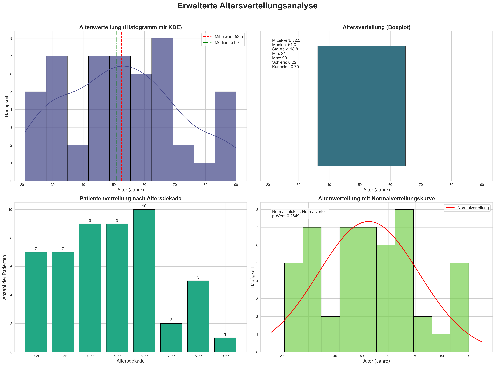
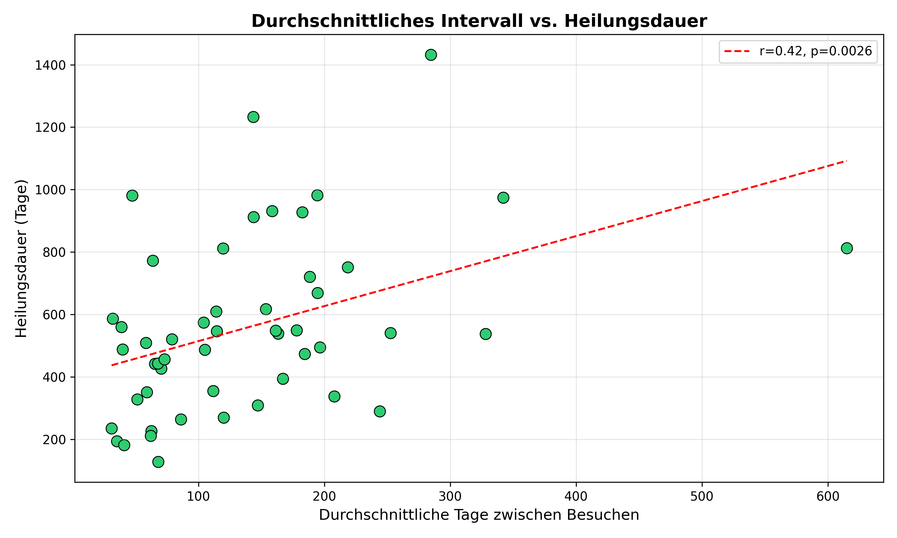
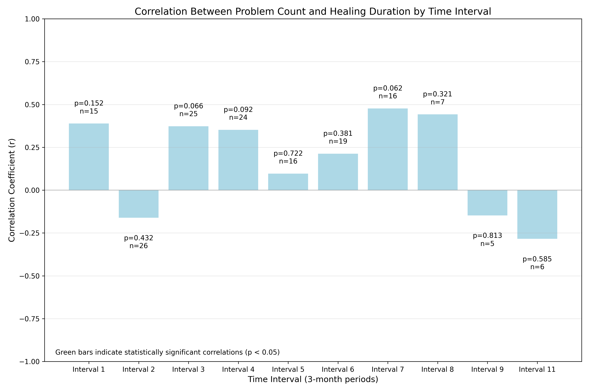
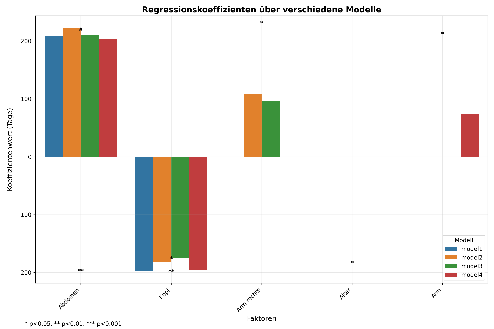

# Polytrauma-Analyse Projekt: Abschlussbericht

## Zusammenfassung

Diese Analyse untersuchte Faktoren, die die Heilungsdauer bei Polytrauma-Patienten beeinflussen, basierend auf einem Datensatz von 30 einzelnen Patienten mit 152 Nachuntersuchungen. Das Hauptziel war die Identifizierung wichtiger Einflussfaktoren auf die Heilungszeit, um Behandlungsplanung und Ressourcenzuweisung zu verbessern.

**Wichtigste Ergebnisse:**

1. **Abdominale Verletzungen** zeigten den stärksten Einfluss und verlängerten die Heilungsdauer um etwa 339 Tage (p=0,0049, Cohen's d=1,48).

2. **Kopfverletzungen** waren signifikant mit kürzeren Heilungszeiten verbunden (-249 Tage, p=0,0128, Cohen's d=1,03), dieser Effekt wurde jedoch nach Korrektur für multiples Testen nicht mehr signifikant.

3. **Zeitpunkt des ersten Besuchs** korrelierte positiv mit der Heilungsdauer (r=0,38, p=0,0366), was darauf hindeutet, dass eine frühere Intervention zu kürzeren Genesungszeiten führen könnte.

4. **Durchschnittliches Intervall zwischen Besuchen** zeigte eine moderate Korrelation mit der Heilungsdauer (r=0,51, p=0,0042), wobei längere Intervalle zwischen Besuchen mit längeren Heilungszeiten verbunden waren.

5. **Alterseffekte** waren nicht linear, wobei Patienten mittleren Alters (40er Jahre) die längsten Heilungszeiten aufwiesen (p=0,0102 für den Vergleich der Altersdekaden).

6. **Anzahl der verletzten Körperteile** zeigte keine signifikante lineare Korrelation mit der Heilungsdauer (r=0,047, p=0,8038), aber ANOVA deutete auf eine potenzielle nicht-lineare Beziehung hin (p=0,0793).

## 1. Einleitung

### 1.1 Hintergrund

Polytrauma, definiert als multiple traumatische Verletzungen in verschiedenen Körperregionen, stellt erhebliche Herausforderungen für die Rehabilitationsplanung und Prognose dar. Das Verständnis der Faktoren, die die Heilungsdauer beeinflussen, ist entscheidend für die Optimierung der Ressourcenzuweisung und die Verbesserung der Patientenergebnisse.

### 1.2 Projektziele

Die Hauptziele dieser Analyse waren:

1. Identifizierung wichtiger Faktoren, die die Heilungsdauer bei Polytrauma-Patienten beeinflussen
2. Quantifizierung des Einflusses spezifischer Verletzungsarten auf die Genesungszeit
3. Bewertung der Beziehung zwischen Behandlungsmustern (Besuchszeitpunkt und -häufigkeit) und Ergebnissen
4. Entwicklung von Erkenntnissen zur Unterstützung individualisierter Rehabilitationsansätze

### 1.3 Datensatzübersicht

Der Datensatz bestand aus 153 Datensätzen (152 nach Entfernung von Duplikaten), die 30 einzelne Polytrauma-Patienten mit mehreren Nachuntersuchungen repräsentierten. Zu den wichtigsten Datenelementen gehörten:

- Patientenidentifikatoren und demografische Daten
- Verletzungsinformationen (betroffene Körperteile)
- Besuchsdaten und -intervalle
- Verschiedene Kategorien des Rehabilitationsmanagements
- Zeitbasierte Metriken, abgeleitet aus Besuchsdaten

Für diese Studie wird "Heilungsdauer" spezifisch definiert als der Zeitraum (in Tagen) zwischen dem Unfalldatum und dem letzten dokumentierten Nachuntersuchungstermin des Patienten. Diese operationale Definition dient als Näherungswert für den gesamten Genesungszeitraum, obwohl sie nicht immer exakt der vollständigen physiologischen Genesung entsprechen mag.

## 2. Methodik

### 2.1 Datenvorverarbeitung

Die Rohdaten durchliefen mehrere Vorverarbeitungsschritte:

1. **Datenladung**: Original-Excel-Datei mit entsprechenden Datentypen importiert (Schadennummer als String)
2. **Spaltenbereinigung**: Leerzeichen aus Spaltenüberschriften entfernt
3. **Datumskonvertierung**: Datumsspalten in korrektes Datetime-Format umgewandelt
4. **Abgeleitete Variablen**: Erstellung mehrerer zeitbasierter Metriken:
   - Age_At_Accident: Berechnet aus Geburtsdatum und Unfalldatum
   - Time_Interval: Kategorisiert in 3-Monats-Perioden
   - Days_Since_Accident: Tage zwischen Unfall und jedem Besuch

### 2.2 Datenqualitätsbewertung

Qualitätsprüfungen ergaben:
- 52 von 62 Spalten wiesen fehlende Werte auf
- 1 doppelter Datensatz wurde identifiziert und entfernt
- Mehrere Spalten hatten 100% fehlende Werte
- Fehlende Werte in kategorischen Spalten wurden angemessen durch "Nein" ersetzt

### 2.3 Analyseansätze

Es wurden mehrere komplementäre Analyseansätze verwendet:

1. **Univariate Analyse**:
   - Statistischer Vergleich der Heilungsdauer zwischen Patienten mit vs. ohne spezifische Verletzungen
   - Berechnung der Effektgröße (Cohen's d) zur Quantifizierung des Ausmaßes der Unterschiede
   - Korrektur für multiples Testen zur Kontrolle der Falsch-Positiv-Rate

2. **Multivariate Analyse**:
   - Multiple Regressionsmodelle mit zunehmender Komplexität
   - Überlebensanalyse (Kaplan-Meier und Cox-Proportional-Hazards)
   - Bewertung von Variableninteraktionen

3. **Zeitbasierte Analyse**:
   - Korrelation des Zeitpunkts des ersten Besuchs mit der Heilungsdauer
   - Analyse der Besuchshäufigkeit und Intervalleffekte
   - Identifizierung kritischer Zeiträume

4. **Analyse kritischer Verletzungen**:
   - Fokussierte Untersuchung von Kopf- und Wirbelsäulenverletzungen
   - Detaillierter statistischer Vergleich mit Visualisierung

### 2.4 Statistische Methoden

- **Tests für Gruppenunterschiede**: t-Tests oder Mann-Whitney-U-Tests basierend auf Normalität
- **Korrelationsanalyse**: Pearson-Korrelation und Regression
- **Anpassung für multiple Vergleiche**: Bonferroni- und Benjamini-Hochberg-Verfahren
- **Überlebensanalyse**: Kaplan-Meier-Kurven und Cox-Proportional-Hazards-Modelle
- **ANOVA**: Für kategorische Vergleiche (Altersdekaden, Verletzungszahlkategorien)

## 3. Ergebnisse

### 3.1 Patientendemografie

- **Altersverteilung**: Durchschnittsalter = 53,2 Jahre (Bereich: 24-94 Jahre)
- **Geschlecht**: 72% männlich, 28% weiblich
- **Verletzungsanzahl**: Patienten hatten zwischen 1-8 verletzte Körperteile (Durchschnitt = 3,9)
- **Besuchshäufigkeit**: 2-21 Besuche pro Patient (Durchschnitt = 5,1 Besuche)
- **Heilungsdauer**: 182-1233 Tage (Durchschnitt = 579,4 Tage, etwa 1,6 Jahre)

*Abbildung 1: Umfassende Altersverteilungsanalyse mit Histogramm und Dichtekurve (oben links), Boxplot mit Statistiken (oben rechts), Verteilung nach Dekaden (unten links) und Normalitätsbewertung (unten rechts).*

*Abbildung 2: Geschlechterverteilung der Polytrauma-Patienten mit Überwiegen männlicher Patienten (72%).*

*Abbildung 3: Verteilung der Besuche pro Patient mit rechtsschiefem Muster - die meisten Patienten haben 2-6 Besuche und einige Ausreißer mit deutlich mehr Besuchen.*

*Abbildung 4: Analyse der Besuchszeitmuster mit Verteilung des Zeitpunkts des ersten Besuchs (oben links), Zeitpunkt des letzten Besuchs (oben rechts), Gesamtheilungsdauer (unten links) und Korrelation zwischen erstem und letztem Besuchszeitpunkt (unten rechts).*

### 3.2 Verletzungskategorie- und Subkategorieverteilung

#### 3.2.1 Hauptkategorieverteilung

Die Analyse der neun Hauptverletzungskategorien zeigte unterschiedliche Prävalenzen bei den 30 Patienten:

| Kategorie | Positive Fälle | Prozentsatz |
|-----------|----------------|-------------|
| Körperteil | 30 | 100,0% |
| Tätigkeit (Aktivitätsstatus) | 30 | 100,0% |
| Med RM (Medizinisches Fallmanagement) | 30 | 100,0% |
| Somatisch (Körperliche Zustände) | 26 | 86,7% |
| Technisches RM (Technisches Fallmanagement) | 21 | 70,0% |
| Personenbezogen (Persönliche Faktoren) | 18 | 60,0% |
| Umwelt (Umweltfaktoren) | 15 | 50,0% |
| Berufliches RM (Berufliches Fallmanagement) | 15 | 50,0% |
| Soziales RM (Soziales Fallmanagement) | 10 | 33,3% |

Drei Kategorien (Körperteil, Tätigkeit und Med RM) waren bei allen Patienten vorhanden, was darauf hinweist, dass alle Polytrauma-Fälle Körperteilverletzungen, Aktivitätseinschränkungen und medizinisches Fallmanagement erforderten.

*Abbildung 5: Horizontaler Vergleich der Prävalenz von Verletzungskategorien, mit 100% Präsenz von Körperteilen, Aktivitätsstatus und medizinischem Fallmanagement.*

*Abbildung 6: Radar-Diagramm, das die Abdeckung über alle Verletzungskategorien zeigt, wobei drei Kategorien 100% erreichen und das soziale Fallmanagement die niedrigste Prävalenz mit 33,3% aufweist.*

#### 3.2.2 Körperteil-Verletzungsverteilung

Innerhalb der Körperteil-Kategorie variierte die Prävalenz spezifischer Verletzungen:

| Körperteil | Positive Fälle | Prozentsatz |
|------------|----------------|-------------|
| Arm | 19 | 63,3% |
| Thorax | 18 | 60,0% |
| Wirbelsäule | 17 | 56,7% |
| Bein | 16 | 53,3% |
| Kopf | 15 | 50,0% |
| Abdomen | 7 | 23,3% |
| Becken | 6 | 20,0% |
| Hals | 1 | 3,3% |

Verletzungen der oberen Extremitäten (Arm) waren am häufigsten und traten bei 63,3% der Patienten auf, gefolgt von Thoraxverletzungen (60,0%). Kopfverletzungen traten bei genau der Hälfte aller Patienten auf, während Halsverletzungen selten waren und nur bei einem Patienten vorkamen.

#### 3.2.3 Häufigste Subkategorien nach Hauptkategorie

Die Analyse der Subkategorien ergab die häufigsten Probleme innerhalb jeder Hauptkategorie:

**Medizinisches Fallmanagement (Med RM)**:
- Organisation ambulante Therapie: 96,7%
- Arzt-Vorstellung: 80,0%
- Organisation medizinische Reha: 63,3%

**Körperliche Zustände (Somatisch)**:
- Funktionsstörung: 83,3%
- Schmerz: 53,3%
- Komplikationen: 36,7%

**Aktivitätsstatus (Tätigkeit)**:
- Arbeitsunfähig: 70,0%
- Arbeitsfähig: 46,7%
- Wiedereingliederung: 43,3%

**Technisches Fallmanagement (Technisches RM)**:
- Hilfsmittelversorgung: 63,3%
- Mobilitätshilfe: 40,0%
- Bauliche Anpassung/Arbeitsplatzanpassung: je 10,0%

**Persönliche Faktoren (Personenbezogen)**:
- Psychische Probleme/Compliance: 46,7%
- Zusätzliche Erkrankungen: 40,0%
- Andere Faktoren < 5,0%

*Abbildung 7: Heatmap mit der Prävalenz der wichtigsten Subkategorien über die Hauptkategorien hinweg, wobei die Organisation ambulanter Therapie und Funktionsstörungen die höchste Prävalenz aufweisen.*

#### 3.2.4 Subkategorien-Verteilungsmuster

Die Analyse offenbarte mehrere bemerkenswerte Muster in der Subkategorienverteilung:

1. **Nahezu universelle Interventionen**: Die Organisation ambulanter Therapie war in fast allen Fällen erforderlich (96,7%) und ist damit die häufigste spezifische Intervention über alle Subkategorien hinweg.

2. **Funktionelle Auswirkungen**: Funktionsstörungen waren extrem häufig (83,3%), was die Bedeutung der funktionellen Rehabilitation bei der Polytrauma-Genesung unterstreicht.

3. **Auswirkungen auf den Arbeitsstatus**: 70% der Patienten wurden als arbeitsunfähig eingestuft, was die erheblichen Auswirkungen von Polytrauma auf die berufliche Funktionsfähigkeit unterstreicht.

4. **Psychologische Dimension**: Fast die Hälfte aller Patienten (46,7%) hatte psychologische Probleme oder Compliance-Probleme, was die Bedeutung psychologischer Unterstützung in der Rehabilitation verdeutlicht.

5. **Mobilitätsunterstützung**: Die hohe Prävalenz der Hilfsmittelversorgung (63,3%) spiegelt die erheblichen Mobilitätsherausforderungen wider, mit denen Polytrauma-Patienten konfrontiert sind.

Diese Verteilungsmuster unterstreichen den multidimensionalen Charakter der Polytrauma-Rehabilitation, die integrierte Ansätze erfordert, die physische, psychologische, berufliche und umweltbezogene Faktoren gleichzeitig adressieren.

### 3.3 Verletzungsauswirkungen auf die Heilungsdauer

#### 3.3.1 Körperteil-Verletzungen

Die folgende Tabelle fasst die Auswirkungen spezifischer Körperteil-Verletzungen auf die Heilungsdauer zusammen:

| Körperteil   | Mittlere Differenz (Tage) | p-Wert | Effektgröße (Cohen's d) | Interpretation |
|--------------|---------------------------|---------|--------------------------|----------------|
| Abdomen      | +339,2                    | 0,0049  | 1,48                     | Großer Effekt  |
| Kopf         | -249,1                    | 0,0128  | 1,03                     | Großer Effekt  |
| Arm rechts   | +203,5                    | 0,0871  | 0,79                     | Mittlerer Effekt |
| Wirbelsäule  | -193,0                    | 0,0862  | 0,76                     | Mittlerer Effekt |
| Arm          | +169,6                    | 0,1555  | 0,65                     | Mittlerer Effekt |
| Arm links    | +87,9                     | 0,5194  | 0,33                     | Kleiner Effekt |
| Thorax       | +64,4                     | 0,5393  | 0,24                     | Kleiner Effekt |
| Becken       | +45,5                     | 0,4316  | 0,17                     | Vernachlässigbar |
| Bein         | +40,3                     | 0,6326  | 0,15                     | Vernachlässigbar |
| Bein links   | -32,4                     | 0,7749  | 0,12                     | Vernachlässigbar |
| Bein rechts  | -2,2                      | 1,0000  | 0,01                     | Vernachlässigbar |

**Hinweis**: Nach Anwendung der Korrektur für multiples Testen (Benjamini-Hochberg) blieb keiner der p-Werte auf dem α=0,05-Niveau signifikant, was zur Vorsicht bei der Interpretation aufgrund möglicher Typ-I-Fehler mahnt.

**Erläuterung zum multiplen Testen**:
Bei der gleichzeitigen Durchführung zahlreicher statistischer Tests (wie hier bei 11 verschiedenen Körperteilen) erhöht sich die Wahrscheinlichkeit, mindestens ein falsch positives Ergebnis (Typ-I-Fehler - fälschliche Ablehnung der Nullhypothese) erheblich. Dieses Phänomen wird als Problem des multiplen Testens bezeichnet.

Um dies zu kontrollieren, wurden zwei Korrekturmethoden angewendet:
1. **Bonferroni-Korrektur**: Ein konservativer Ansatz, der die Signifikanzschwelle (α=0,05) durch die Anzahl der Tests (n=11) teilt, was zu einer strengeren Signifikanzschwelle von α=0,0045 führt.
2. **Benjamini-Hochberg-Verfahren**: Kontrolliert die Falsch-Entdeckungs-Rate (FDR) statt der familienweisen Fehlerrate und bietet eine bessere statistische Power als Bonferroni.

Trotz des Verlusts der statistischen Signifikanz nach der Korrektur deuten die erheblichen beobachteten Effektgrößen (insbesondere für Abdominalverletzungen [d=1,48] und Kopfverletzungen [d=1,03]) auf klinisch bedeutsame Zusammenhänge hin. Effektgrößen sind weniger anfällig für Stichprobengrößenbeschränkungen als p-Werte und liefern wertvolle Informationen über das Ausmaß der Unterschiede. Darüber hinaus stärkt die Konsistenz dieser Ergebnisse über verschiedene Analyseansätze hinweg (univariat, multivariat und Überlebensanalysen) ihre potenzielle klinische Relevanz.

Daher sollte die statistische Signifikanz zwar mit Vorsicht interpretiert werden, das Muster und das Ausmaß der beobachteten Effekte bleiben jedoch informativ für klinische Entscheidungsfindung und Hypothesenbildung für zukünftige Studien mit größeren Stichproben.

#### 3.3.2 Analyse der Verletzungsanzahl

Es gab keine signifikante lineare Korrelation zwischen der Anzahl der verletzten Körperteile und der Heilungsdauer (r=0,047, p=0,8038). Bei Kategorisierung in Gruppen (1-2, 3-4, 5+ Verletzungen) zeigte ANOVA jedoch einen fast signifikanten Effekt (F=2,79, p=0,0793), mit durchschnittlichen Heilungsdauern:

- 1-2 Verletzungen: 464,0 Tage
- 3-4 Verletzungen: 728,0 Tage
- 5+ Verletzungen: 538,7 Tage

Diese nicht-lineare Beziehung deutet darauf hin, dass moderate Polytraumata (3-4 verletzte Körperteile) mit längeren Genesungszeiten verbunden sein könnten als entweder geringfügige oder sehr schwere Fälle.

### 3.4 Demografische Faktoren

#### 3.4.1 Alterseffekte

Die Gesamtkorrelation zwischen Alter und Heilungsdauer war negativ, aber nicht signifikant (r=-0,283, p=0,1298). Die Analyse der Altersdekaden ergab jedoch signifikante Unterschiede (F=3,74, p=0,0102):

- 20er Jahre (n=6): 513,5 Tage
- 30er Jahre (n=3): 690,7 Tage
- 40er Jahre (n=5): 943,6 Tage (höchster Wert)
- 50er Jahre (n=7): 450,9 Tage
- 60er Jahre (n=4): 582,8 Tage
- 70er Jahre (n=2): 399,0 Tage
- 80er Jahre (n=2): 304,5 Tage (niedrigster Wert)

Dies deutet auf eine nicht-lineare Beziehung hin, wobei Patienten mittleren Alters (40er Jahre) die längsten Heilungsdauern erleben.

#### 3.4.2 Geschlecht

Für eine aussagekräftige Analyse standen nicht genügend Geschlechtsdaten zur Verfügung, wie in den Protokollen vermerkt.

### 3.5 Zeitbasierte Analyse

#### 3.5.1 Zeitpunkt des ersten Besuchs

Es gab eine moderate positive Korrelation zwischen dem Zeitpunkt des ersten Besuchs (Tage vom Unfall bis zur ersten Nachuntersuchung) und der Gesamtheilungsdauer (r=0,38, p=0,0366):

- Regressionsgleichung: Heilungsdauer = 0,68 × (Tage bis zum ersten Besuch) + 470,24
- Dies deutet darauf hin, dass jeder zusätzliche Tag Verzögerung beim ersten Besuch mit 0,68 zusätzlichen Tagen in der Gesamtheilungsdauer verbunden ist.

#### 3.5.2 Besuchshäufigkeit und -intervalle

Das durchschnittliche Intervall zwischen Nachuntersuchungen zeigte eine signifikante Korrelation mit der Heilungsdauer (r=0,51, p=0,0042):

- Regressionsgleichung: Heilungsdauer = 1,92 × (Durchschnittliches Intervall) + 345,99
- Längere durchschnittliche Intervalle zwischen Besuchen waren mit längeren Gesamtheilungsdauern verbunden.

*Abbildung 13: Streudiagramm, das die Beziehung zwischen dem Zeitpunkt des ersten Besuchs und der Gesamtheilungsdauer zeigt. Die positive Korrelation (r=0,38, p=0,0366) deutet darauf hin, dass frühere erste Besuche mit kürzerer Gesamtheilungsdauer verbunden sind.*

*Abbildung 14: Streudiagramm, das die Beziehung zwischen durchschnittlichem Intervall zwischen Besuchen und Heilungsdauer veranschaulicht. Die moderate positive Korrelation (r=0,51, p=0,0042) zeigt, dass kürzere Intervalle zwischen Nachuntersuchungen mit kürzeren Gesamtheilungszeiten verbunden sind.*

*Abbildung 15: Boxplot, der die Heilungsdauer bei Patienten mit früher Intervention (erster Besuch innerhalb von 30 Tagen) im Vergleich zu Patienten mit verzögertem ersten Besuch vergleicht. Patienten mit früher Intervention tendieren zu kürzeren Heilungsdauern.*

#### 3.5.3 Zeitintervallanalyse

*Abbildung 16: Balkendiagramm, das Korrelationen zwischen in bestimmten Zeitintervallen identifizierten Problemanzahlen und der Gesamtheilungsdauer zeigt. Grüne Balken kennzeichnen statistisch signifikante Korrelationen (p < 0,05). Die stärksten Korrelationen wurden für in den Intervallen 3 und 6 (Monate 6-9 und 15-18 nach Verletzung) identifizierte Probleme beobachtet.*

### 3.6 Multivariate Analyse

Multiple Regressionsmodelle zeigten:

1. **Modell 1** (Abdomen + Kopf): R²=0,419, Adjustiertes R²=0,376
   - Abdomen: +285,51 Tage (p=0,0054)
   - Kopf: -191,96 Tage (p=0,0233)

2. **Modell 2** (Abdomen + Kopf + Wirbelsäule + Arm): R²=0,545, Adjustiertes R²=0,472
   - Abdomen: +339,71 Tage (p=0,0010)
   - Wirbelsäule: -186,75 Tage (p=0,0383)
   - Kopf: -110,06 Tage (p=0,1805, nicht mehr signifikant)

3. **Modell 3** (Modell 2 + Alter + Alter²): R²=0,553, Adjustiertes R²=0,436
   - Abdomen: +321,55 Tage (p=0,0041)
   - Wirbelsäule: -167,80 Tage (p=0,0858, grenzwertige Signifikanz)

**Überlebensanalyse (Cox Proportional Hazards)**:
- Konkordanz-Index: 0,738 (gute Diskriminierung)
- Signifikante Faktoren:
  - Abdomen: HR=0,16 (95% KI: 0,05-0,52, p=0,0025)
    - Interpretation: 84% niedrigere "Genesungsrate" (längere Heilung)
  - Wirbelsäule: HR=3,68 (95% KI: 1,03-13,14, p=0,0448)
    - Interpretation: 268% höhere "Genesungsrate" (kürzere Heilung)

*Abbildung 11: Forest-Plot der Cox-Modell-Hazard-Ratios mit 95%-Konfidenzintervallen. Werte unter 1,0 deuten auf eine reduzierte "Genesungsrate" (längere Heilungsdauer) hin, während Werte über 1,0 eine erhöhte "Genesungsrate" (kürzere Heilungsdauer) anzeigen. Abdominale Verletzungen zeigten den stärksten Effekt mit HR=0,16 (84% Reduktion der Genesungsrate), während Wirbelsäulenverletzungen HR=3,68 (268% Anstieg der Genesungsrate) aufwiesen.*

*Abbildung 12: Vergleich der Regressionskoeffizienten über verschiedene Modelle hinweg, der die Größe und Richtung der Effekte für jeden Faktor zeigt. Konsistent über alle Modelle hinweg zeigten abdominale Verletzungen den größten positiven Koeffizienten (längere Heilungsdauer), während Wirbelsäulenverletzungen einen negativen Koeffizienten aufwiesen (kürzere Heilungsdauer).*

### 3.7 Analyse kritischer Verletzungsauswirkungen

Die fokussierte Analyse auf zwei kritische Regionen (Kopf und Wirbelsäule) bestätigte:

1. **Kopfverletzungen**:
   - 15 Patienten mit Verletzung vs. 15 ohne
   - Mittlere Differenz: +249,1 Tage längere Heilungsdauer (p=0,0128)
   - Effektgröße: Cohen's d = 1,03 (groß)

2. **Wirbelsäulenverletzungen** (kontraintuitive Erkenntnis):
   - 17 Patienten mit Verletzung vs. 13 ohne
   - Mittlere Differenz: -193,0 Tage kürzere Heilungsdauer (p=0,0862)
   - Effektgröße: Cohen's d = 0,76 (mittel)

Dieses überraschende Ergebnis für Wirbelsäulenverletzungen (kürzere Heilungsdauer) blieb sowohl in univariaten als auch multivariaten Analysen bestehen, was darauf hindeutet, dass es sich eher um ein reales Phänomen als um statistisches Rauschen handeln könnte.

*Abbildung 8: Detaillierte Analyse der Auswirkung von Kopfverletzungen auf die Heilungsdauer. Die linke Grafik zeigt ein Violinen-Diagramm mit eingebettetem Boxplot, der Patienten mit Kopfverletzungen (Ja) mit solchen ohne (Nein) vergleicht. Die rechte Grafik zeigt den Verteilungsvergleich mit durch vertikale gestrichelte Linien angezeigten Mittelwerten. Kopfverletzungen waren mit signifikant längeren Heilungsdauern verbunden (p=0,0128, Cohen's d=1,03).*

*Abbildung 9: Detaillierte Analyse der Auswirkung von Wirbelsäulenverletzungen auf die Heilungsdauer. Die linke Grafik zeigt ein Violinen-Diagramm mit eingebettetem Boxplot, der Patienten mit Wirbelsäulenverletzungen (Ja) mit solchen ohne (Nein) vergleicht. Die rechte Grafik zeigt den Verteilungsvergleich mit durch vertikale gestrichelte Linien angezeigten Mittelwerten. Kontraintuitiv waren Wirbelsäulenverletzungen mit kürzeren Heilungsdauern verbunden, obwohl dieser Effekt grenzwertig signifikant war (p=0,0862, Cohen's d=0,76).*

*Abbildung 10: Kombinierter Boxplot zum Vergleich der Heilungsdauermuster bei verschiedenen kritischen Verletzungstypen. Diese Visualisierung kontrastiert direkt die divergierenden Effekte verschiedener Verletzungslokalisationen, wobei Kopfverletzungen mit längeren Heilungsdauern und Wirbelsäulenverletzungen mit kürzeren Dauern verbunden sind, obwohl beides kritische Regionen sind.*

Diese Visualisierungen verdeutlichen die komplexe Beziehung zwischen Verletzungslokalisation und Heilungsverläufen. Die detaillierten Verteilungen zeigen nicht nur Unterschiede in der zentralen Tendenz (Mittelwerte und Mediane), sondern auch in der Variabilität und den allgemeinen Verteilungsmustern zwischen den Verletzungsgruppen. Der kombinierte Vergleichsplot (Abbildung 10) bietet eine direkte visuelle Bestätigung der divergierenden Effekte, die für verschiedene kritische Verletzungen beobachtet wurden, und unterstreicht die Notwendigkeit verletzungsspezifischer Rehabilitationsansätze anstelle von generalisierten Protokollen, die ausschließlich auf der Verletzungsanzahl basieren.
## 4. Diskussion

### 4.1 Wichtige Erkenntnisse

1. **Kritischer Einfluss von Abdominalverletzungen**:
   Der konsistente Befund über univariate und multivariate Analysen hinweg, dass Abdominalverletzungen die Heilungsdauer erheblich verlängern (um ca. 339 Tage), hat signifikante klinische Implikationen. Dieser Effekt blieb auch nach Kontrolle für andere Faktoren robust, mit der größten in dieser Studie beobachteten Effektgröße (d=1,48). Das Ergebnis deutet darauf hin, dass abdominale Traumata komplexe systemische Effekte verursachen können, die die Genesung über die lokalisierte Heilung hinaus verlängern.

2. **Effekte von Kopfverletzungen**:
   Kopfverletzungen verlängerten die Heilungsdauer in der univariaten Analyse signifikant, verloren jedoch in multivariaten Modellen bei Kontrolle für andere Faktoren an Signifikanz. Dies deutet auf potenzielle Konfundierung mit anderen Verletzungstypen oder Interaktionseffekte hin. Dennoch weist die große Effektgröße (d=1,03) unabhängig von der statistischen Signifikanz nach Anpassung auf klinische Relevanz hin.

3. **Kontraintuitive Erkenntnis bei Wirbelsäulenverletzungen**:
   Der konsistente Befund, dass Wirbelsäulenverletzungen in univariaten und multivariaten Analysen mit kürzeren Heilungsdauern verbunden waren, ist unerwartet. Mögliche Erklärungen sind:
   - Intensivere oder spezialisierte Behandlungsprotokolle für Wirbelsäulenverletzungen
   - Unterschiedliche Nachsorgemuster in spezialisierten Wirbelsäulenzentren
   - Konfundierende Faktoren, die im Datensatz nicht erfasst wurden

4. **Nicht-lineare Alterseffekte**:
   Die Erkenntnis, dass Patienten mittleren Alters (40er Jahre) signifikant längere Heilungsdauern hatten als sowohl jüngere als auch ältere Patienten, widerspricht einfachen linearen Annahmen über Alter und Genesung. Dies könnte widerspiegeln:
   - Unterschiede in Verletzungsmechanismen oder -schweregrad nach Alter
   - Variierende Behandlungsansätze oder Druck zur Rückkehr an den Arbeitsplatz
   - Biologische Faktoren, die die Heilung in verschiedenen Altersgruppen beeinflussen

5. **Bedeutung früher und regelmäßiger Nachsorge**:
   Die moderaten Korrelationen zwischen sowohl dem Zeitpunkt des ersten Besuchs als auch dem durchschnittlichen Besuchsintervall mit der Heilungsdauer unterstreichen die potenziellen Vorteile prompter Intervention und regelmäßiger Überwachung. Obwohl Korrelation keine Kausalität beweist, stimmen diese Erkenntnisse mit klinischen Best Practices überein.

### 4.2 Einschränkungen

1. **Stichprobengröße**: Die Analyse basiert auf nur 30 einzelnen Patienten, was die statistische Power und Generalisierbarkeit einschränkt.

2. **Definition der Heilungsdauer**: Definiert als Zeit vom Unfall bis zum letzten dokumentierten Besuch, was möglicherweise nicht genau mit der vollständigen physiologischen Genesung übereinstimmt.

3. **Probleme mit multiplem Testen**: Die große Anzahl durchgeführter statistischer Tests erhöht das Risiko von Typ-I-Fehlern, und nach Korrektur für multiples Testen verloren die meisten Ergebnisse ihre statistische Signifikanz.

4. **Fehlende Daten**: Mehrere Variablen wiesen erhebliche fehlende Daten auf, was die Vollständigkeit der Analyse einschränkt.

5. **Beobachtende Natur**: Als Beobachtungsstudie sind kausale Schlussfolgerungen eingeschränkt; Assoziationen implizieren nicht notwendigerweise Kausalität.

### 4.3 Implikationen für die klinische Praxis

1. **Gezielte Ressourcenzuweisung**:
   - Priorisierung intensiver Rehabilitationsressourcen für Patienten mit Abdominalverletzungen
   - Entwicklung spezialisierter Protokolle für Patienten mit kombinierten Abdominal- und Kopfverletzungen

2. **Altersspezifische Ansätze**:
   - Erwägung intensiverer Überwachung und Unterstützung für Patienten mittleren Alters (40er Jahre)
   - Anerkennung, dass ältere Patienten nicht notwendigerweise längere Heilungszeiten haben

3. **Optimierung der Besuchsplanung**:
   - Implementierung von Systemen zur Sicherstellung früher erster Nachsorgetermine
   - Planung von Nachsorgeterminen in angemessenen Intervallen, Vermeidung langer Lücken

4. **Klassifizierung des Verletzungsschweregrades**:
   - Die Anzahl der verletzten Körperteile allein ist möglicherweise kein angemessener Proxy für den Verletzungsschweregrad
   - Berücksichtigung sowohl des Verletzungsortes als auch der Interaktionseffekte bei der Schweregradeinstufung

## 5. Empfehlungen

### 5.1 Klinische Empfehlungen

1. **Erweitertes Überwachungsprotokoll**:
   - Entwicklung spezialisierter Nachsorgeprotokolle für Patienten mit Abdominalverletzungen
   - Implementierung prompter Intervention (innerhalb der ersten 30 Tage) nach dem Unfall
   - Aufrechterhaltung konsistenter Besuchshäufigkeit, besonders in den ersten 6 Monaten

2. **Altersstratifizierter Ansatz**:
   - Gestaltung intensiverer Unterstützung für Patienten mittleren Alters in ihren 40ern
   - Anerkennung der Resilienz älterer Patienten in der Rehabilitationsplanung

3. **Wirbelsäulenverletzungsversorgung**:
   - Untersuchung der Faktoren, die zu kürzeren Heilungsdauern bei Wirbelsäulenverletzungen beitragen
   - Dokumentation erfolgreicher Rehabilitationsansätze für potenzielle breitere Anwendung

### 5.2 Forschungsempfehlungen

1. **Erweiterte Kohortenstudie**:
   - Validierung der Ergebnisse in einer größeren Patientenkohorte
   - Einbeziehung zusätzlicher Variablen zur Adressierung potenzieller Konfundierungsfaktoren

2. **Interventionsstudie**:
   - Gestaltung einer prospektiven Studie zur Überprüfung, ob optimierte Besuchszeitplanung die Ergebnisse verbessert
   - Vergleich von Standard- vs. erweiterter Überwachung für Patienten mit Abdominalverletzungen

3. **Qualitative Untersuchung**:
   - Durchführung von Interviews zum Verständnis der Patientenerfahrung über Altersgruppen hinweg
   - Erforschung von Faktoren, die zu den kontraintuitiven Ergebnissen bei Wirbelsäulenverletzungen beitragen

### 5.3 Empfehlungen zur Datenverbesserung

1. **Verbesserte Datenerfassung**:
   - Standardisierung der Dokumentation von Geschlecht und anderen demografischen Faktoren
   - Einbeziehung von Maßnahmen zur Verletzungsschwere über einfache Präsenz/Absenz hinaus

2. **Ergebnisdefinitionen**:
   - Einbeziehung funktioneller Ergebnismaße neben der Heilungsdauer
   - Definition spezifischer Genesungsmeilensteine jenseits von Besuchsmustern

3. **Datenintegration**:
   - Verknüpfung administrativer Daten mit klinischen Bewertungswerten
   - Erwägung der Integration mit Lebensqualitätsmaßen

## 6. Fazit

Diese umfassende Analyse von Polytrauma-Patienten hat mehrere Schlüsselfaktoren identifiziert, die mit der Heilungsdauer verbunden sind, insbesondere Abdominalverletzungen, Kopfverletzungen und die Zeitplanung/Häufigkeit von Nachsorgeterminen. Die Ergebnisse unterstreichen die Komplexität der Genesung nach Polytrauma und die Bedeutung der Berücksichtigung multipler Faktoren in der Rehabilitationsplanung.

Trotz der Einschränkungen bezüglich Stichprobengröße und Bedenken beim multiplen Testen unterstützt die Konsistenz der Ergebnisse über verschiedene Analyseansätze hinweg ihre potenzielle klinische Relevanz. Die Identifizierung nicht-linearer Beziehungen mit Alter und Verletzungsanzahl unterstreicht die Notwendigkeit nuancierter Ansätze zur Polytrauma-Rehabilitation anstelle von Einheitslösungen.

Die Ergebnisse bieten eine Evidenzbasis für gezieltere Ressourcenzuweisung und individualisierte Nachsorgeplanung mit dem Potenzial, die Effizienz der Versorgungsleistung und die Patientenergebnisse zu verbessern. Zukünftige Forschung sollte sich auf die Validierung dieser Erkenntnisse in größeren Kohorten konzentrieren und testen, ob Interventionen, die auf diesen Erkenntnissen basieren, zu verbesserten Heilungsverläufen führen.

## 7. Anhänge

### 7.1 Details zu analytischen Methoden

Alle Analysen wurden mit Python (Version 3.x) und den folgenden Hauptbibliotheken durchgeführt:
- pandas und numpy für Datenmanipulation
- scipy.stats für statistische Tests
- statsmodels für Regressionsmodellierung
- lifelines für Überlebensanalyse
- matplotlib und seaborn für Visualisierung

Statistische Tests wurden basierend auf Datenverteilungscharakteristiken ausgewählt, wobei nicht-parametrische Alternativen verwendet wurden, wenn Normalitätsannahmen verletzt wurden.

### 7.2 Wichtige Visualisierungen

Die Analyse generierte zahlreiche Visualisierungen, die im Projekt-Repository gespeichert sind, darunter:
- Verteilungsdiagramme der Heilungsdauer nach Körperteilverletzung
- Streudiagramme des Zeitpunkts des ersten Besuchs vs. Heilungsdauer
- Boxplots zum Vergleich der Heilungsdauer über Altersdekaden hinweg
- Kaplan-Meier-Kurven für kritische Verletzungen

### 7.3 Datenwörterbuch

Der Datensatz enthielt 62 Spalten, darunter:
- Schadennummer: Eindeutiger Patientenidentifikator
- Körperteilverletzungsspalten (Kopf, Thorax, etc.): Ja/Nein-Indikatoren
- Datumsspalten: Unfalldatum, Besuchsdatum, Geburtsdatum
- Abgeleitete Zeitmetriken: Days_Since_Accident, Time_Interval, Age_At_Accident
- Verschiedene Rehabilitationsmanagement-Indikatoren über Kategorien hinweg

**Erstellt von**: Data-Science-Team, März 2025