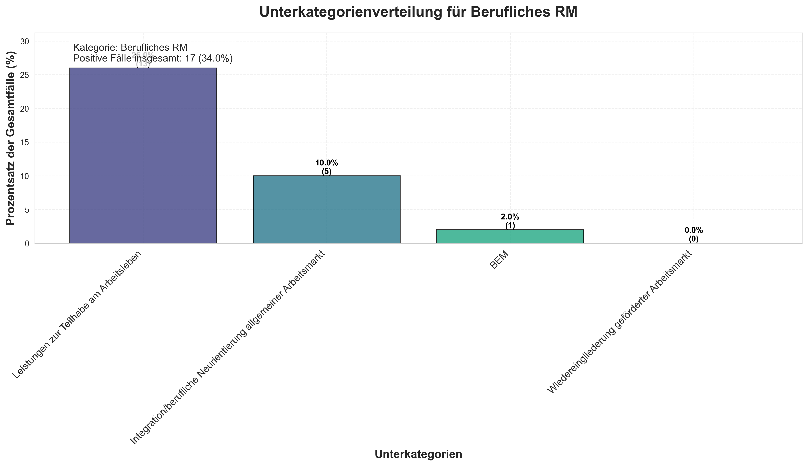
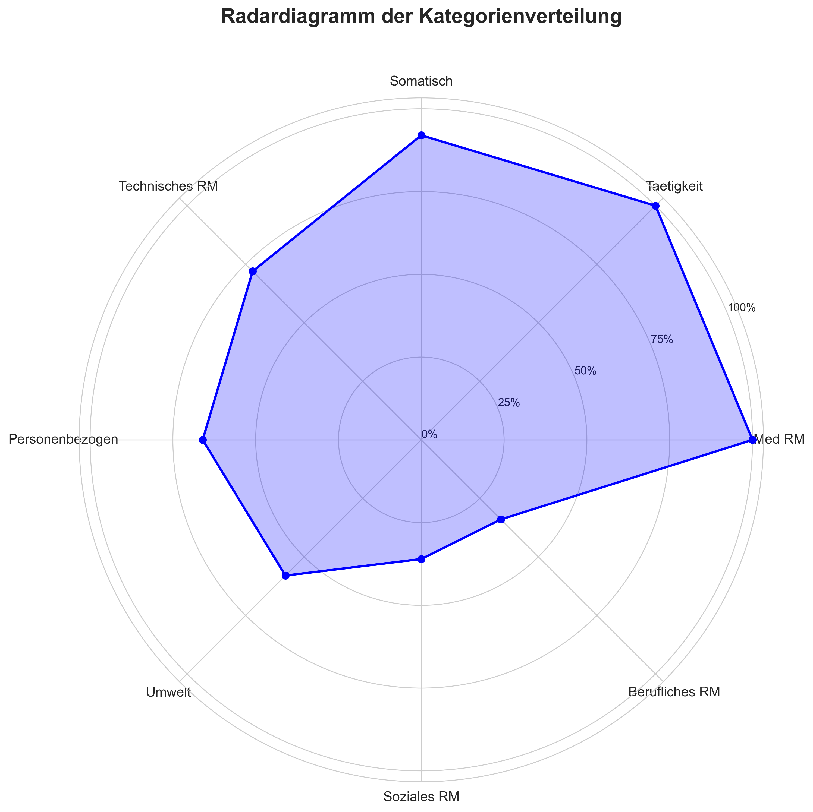
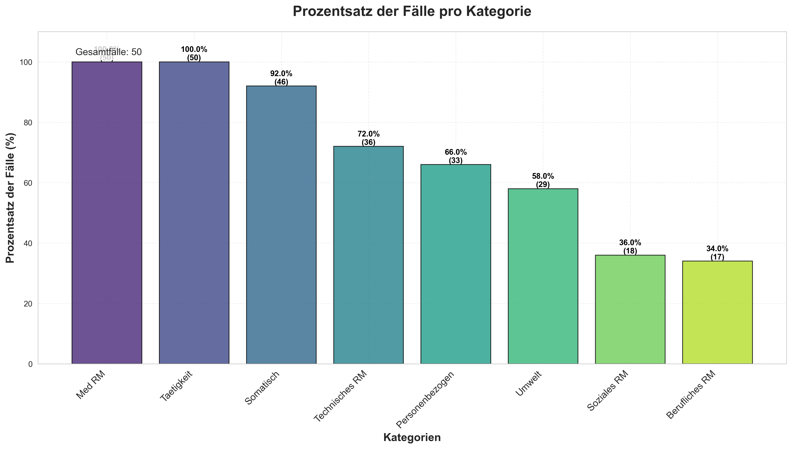
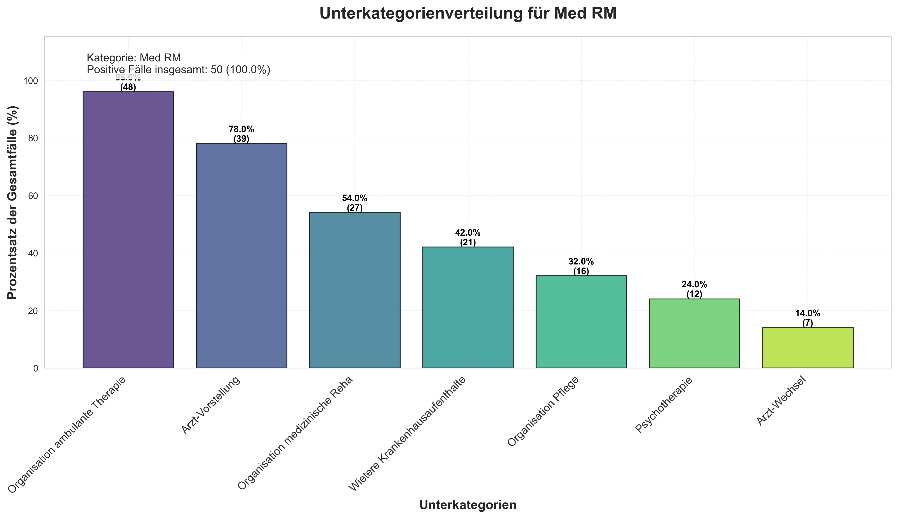
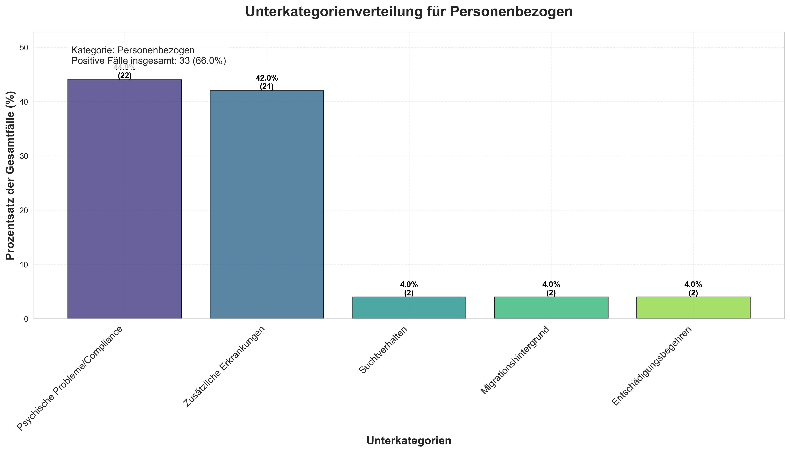
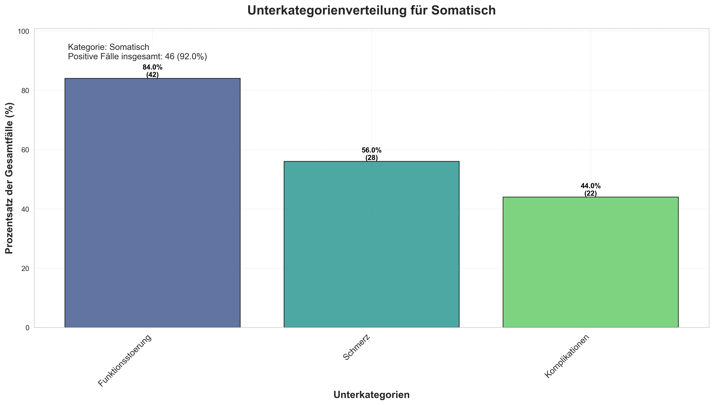
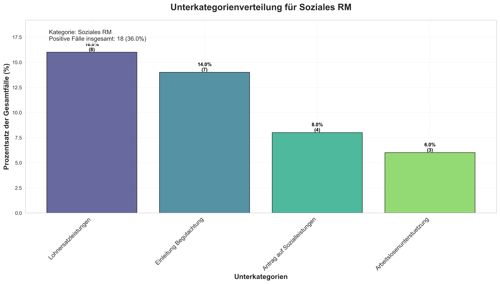
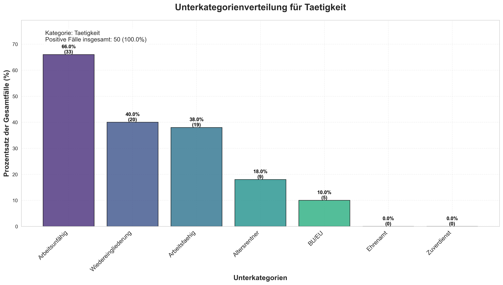
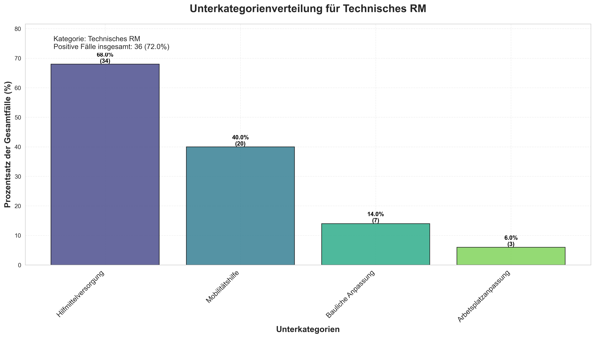
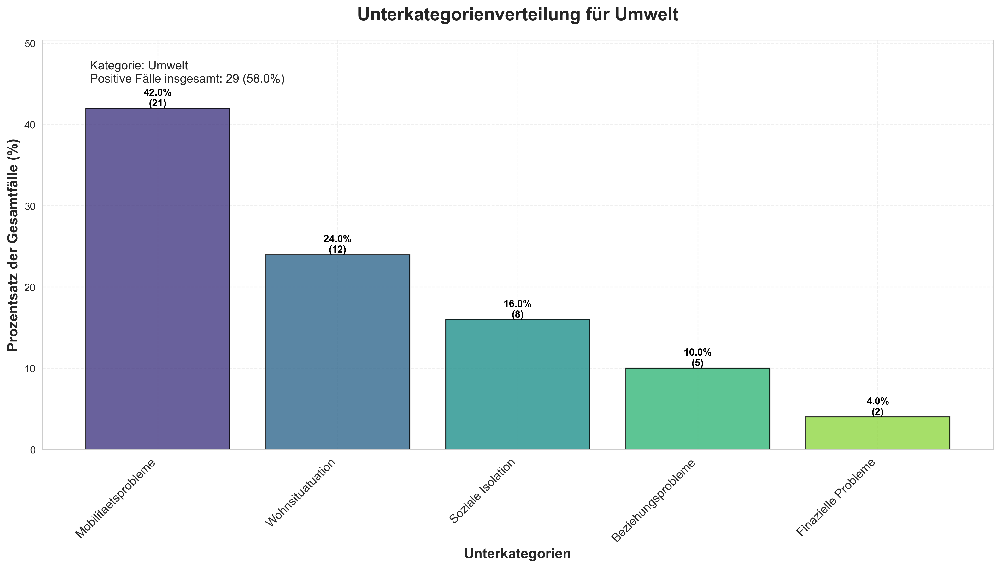

# Analysebericht zur Verteilung der nicht-körperlichen Verletzungskategorien

**Datum der Analyse:** 2025-05-12 12:24:25

## Übersicht

Diese Analyse untersucht die Verteilung von nicht-körperlichen Verletzungskategorien bei...**Hinweis zur Kategorieaggregation:** 'Arm links' und 'Arm rechts' wurden zur Kategorie 'Arm' zusammengefasst. Ebenso wurden 'Bein links' und 'Bein rechts' zur Kategorie 'Bein' zusammengefasst. Ein Fall wird als positiv für diese Kategorien gezählt, wenn mindestens eine der Seiten betroffen ist.

Hinweis: Körperteilverletzungen werden in einer separaten Analyse behandelt.

## Validierungsergebnisse

✅ Alle Validierungsprüfungen wurden erfolgreich bestanden.

## Kategoriezusammenfassung

| Kategorie | Positive Fälle | Prozentual |
|----------|----------------|------------|
| Taetigkeit | 50 | 100.0% |
| Med RM | 50 | 100.0% |
| Somatisch | 46 | 92.0% |
| Technisches RM | 36 | 72.0% |
| Personenbezogen | 33 | 66.0% |
| Umwelt | 29 | 58.0% |
| Soziales RM | 18 | 36.0% |
| Berufliches RM | 17 | 34.0% |

## Detaillierte Unterkategorienanalyse

### Taetigkeit

- **Positive Fälle insgesamt:** 50 (100.0%)
- **Anzahl der Unterkategorien:** 7

#### Unterkategorienaufschlüsselung

| Unterkategorie | Positive Fälle | % der Gesamtfälle | % innerhalb der Kategorie |
|-------------|----------------|------------------|-------------------|
| Arbeitsunfähig | 33 | 66.0% | 66.0% |
| Wiedereingliederung | 20 | 40.0% | 40.0% |
| Arbeitsfaehig | 19 | 38.0% | 38.0% |
| Altersrentner | 9 | 18.0% | 18.0% |
| BU/EU | 5 | 10.0% | 10.0% |
| Ehrenamt | 0 | 0.0% | 0.0% |
| Zuverdienst | 0 | 0.0% | 0.0% |

### Med RM

- **Positive Fälle insgesamt:** 50 (100.0%)
- **Anzahl der Unterkategorien:** 7

#### Unterkategorienaufschlüsselung

| Unterkategorie | Positive Fälle | % der Gesamtfälle | % innerhalb der Kategorie |
|-------------|----------------|------------------|-------------------|
| Organisation ambulante Therapie | 48 | 96.0% | 96.0% |
| Arzt-Vorstellung | 39 | 78.0% | 78.0% |
| Organisation medizinische Reha | 27 | 54.0% | 54.0% |
| Wietere Krankenhausaufenthalte | 21 | 42.0% | 42.0% |
| Organisation Pflege | 16 | 32.0% | 32.0% |
| Psychotherapie | 12 | 24.0% | 24.0% |
| Arzt-Wechsel | 7 | 14.0% | 14.0% |

### Somatisch

- **Positive Fälle insgesamt:** 46 (92.0%)
- **Anzahl der Unterkategorien:** 3

#### Unterkategorienaufschlüsselung

| Unterkategorie | Positive Fälle | % der Gesamtfälle | % innerhalb der Kategorie |
|-------------|----------------|------------------|-------------------|
| Funktionsstoerung | 42 | 84.0% | 91.3% |
| Schmerz | 28 | 56.0% | 60.9% |
| Komplikationen | 22 | 44.0% | 47.8% |

### Technisches RM

- **Positive Fälle insgesamt:** 36 (72.0%)
- **Anzahl der Unterkategorien:** 4

#### Unterkategorienaufschlüsselung

| Unterkategorie | Positive Fälle | % der Gesamtfälle | % innerhalb der Kategorie |
|-------------|----------------|------------------|-------------------|
| Hilfmittelversorgung | 34 | 68.0% | 94.4% |
| Mobilitätshilfe | 20 | 40.0% | 55.6% |
| Bauliche Anpassung | 7 | 14.0% | 19.4% |
| Arbetsplatzanpassung | 3 | 6.0% | 8.3% |

### Personenbezogen

- **Positive Fälle insgesamt:** 33 (66.0%)
- **Anzahl der Unterkategorien:** 5

#### Unterkategorienaufschlüsselung

| Unterkategorie | Positive Fälle | % der Gesamtfälle | % innerhalb der Kategorie |
|-------------|----------------|------------------|-------------------|
| Psychische Probleme/Compliance | 22 | 44.0% | 66.7% |
| Zusätzliche Erkrankungen | 21 | 42.0% | 63.6% |
| Entschädigungsbegehren | 2 | 4.0% | 6.1% |
| Migrationshintergrund | 2 | 4.0% | 6.1% |
| Suchtverhalten | 2 | 4.0% | 6.1% |

### Umwelt

- **Positive Fälle insgesamt:** 29 (58.0%)
- **Anzahl der Unterkategorien:** 5

#### Unterkategorienaufschlüsselung

| Unterkategorie | Positive Fälle | % der Gesamtfälle | % innerhalb der Kategorie |
|-------------|----------------|------------------|-------------------|
| Mobilitaetsprobleme | 21 | 42.0% | 72.4% |
| Wohnsituatuation | 12 | 24.0% | 41.4% |
| Soziale Isolation | 8 | 16.0% | 27.6% |
| Beziehungsprobleme | 5 | 10.0% | 17.2% |
| Finazielle Probleme | 2 | 4.0% | 6.9% |

### Soziales RM

- **Positive Fälle insgesamt:** 18 (36.0%)
- **Anzahl der Unterkategorien:** 4

#### Unterkategorienaufschlüsselung

| Unterkategorie | Positive Fälle | % der Gesamtfälle | % innerhalb der Kategorie |
|-------------|----------------|------------------|-------------------|
| Lohnersatzleistungen | 8 | 16.0% | 44.4% |
| Einleitung Begutachtung | 7 | 14.0% | 38.9% |
| Antrag auf Sozialleistungen | 4 | 8.0% | 22.2% |
| Arbeitslosenunterstuetzung | 3 | 6.0% | 16.7% |

### Berufliches RM

- **Positive Fälle insgesamt:** 17 (34.0%)
- **Anzahl der Unterkategorien:** 4

#### Unterkategorienaufschlüsselung

| Unterkategorie | Positive Fälle | % der Gesamtfälle | % innerhalb der Kategorie |
|-------------|----------------|------------------|-------------------|
| Leistungen zur Teilhabe am Arbeitsleben | 13 | 26.0% | 76.5% |
| Integration/berufliche Neurientierung allgemeiner Arbeitsmarkt | 5 | 10.0% | 29.4% |
| BEM | 1 | 2.0% | 5.9% |
| Wiedereingliederung geförderter Arbeitsmarkt | 0 | 0.0% | 0.0% |

## Visualisierungen

Die folgenden Visualisierungen wurden im Rahmen dieser Analyse erstellt:

### Berufliches Rm Subcategory Distribution

### Category Distribution Radar

### Category Percentage Histogram

### Med Rm Subcategory Distribution

### Personenbezogen Subcategory Distribution

### Somatisch Subcategory Distribution

### Soziales Rm Subcategory Distribution

### Taetigkeit Subcategory Distribution

### Technisches Rm Subcategory Distribution

### Umwelt Subcategory Distribution

## Methodische Hinweise

- Ein Fall wird als positiv für eine Kategorie gezählt, wenn eine ihrer Unterkategorien über beliebige Besuche hinweg einen 'Ja'-Wert aufweist.
- Prozentsätze werden auf Basis der Gesamtzahl der verschiedenen Fälle berechnet.
- Prozentsätze der Unterkategorien werden sowohl als Anteil der Gesamtfälle als auch als Anteil der positiven Fälle innerhalb der Kategorie dargestellt.
- Fehlende Werte in kategorischen Spalten wurden während der Verarbeitung als 'Nein' behandelt.
- Die Kategorien 'Arm' und 'Bein' sind aggregierte Kategorien, die jeweils die linke und rechte Seite zusammenfassen.

## Schlussfolgerung

### Wichtigste Erkenntnisse

**Häufigste Kategorien:**
- Taetigkeit: 100.0% (50 Fälle)
- Med RM: 100.0% (50 Fälle)
- Somatisch: 92.0% (46 Fälle)

**Seltenste Kategorien:**
- Berufliches RM: 34.0% (17 Fälle)
- Soziales RM: 36.0% (18 Fälle)
- Umwelt: 58.0% (29 Fälle)

*Dieser Bericht wurde automatisch im Rahmen der erweiterten Analyse erstellt.*